# SYNTHETIC REPORT : BANK PROCESSING, DNA PROCESSING, SCRAPPING

- Contributeurs : Léo, Yane, Paul, Mika et Naira
- Date : 19/10/2025
- Langage : Python
- Bibliothèques utilisées : tkinter, requests
- Norme de commits : [ADD], [MODIF], [SUPP]

-------------------------------------------------------------

## BANk PROCESSING

### OBJECTIF DU PROJET

Le projet Bank Processing vise à automatiser la génération et la vérification d'IBANs à partir d'un fichier texte mais également une saisie manuelle.
Il permet :
- Extraire les informations d'un RIB à partir d'un fichier .txt
- Générer un IBAN français valide
- Et le vérifier grâce à l'API OpenIBAN

### MÉTHODOLOGIE

#### Architecture du code

Lecture et extraction du fichier

- open_file(file_name) : ouvre le fichier .txt et vérifie s'il est vide ou inexistant

- extract_iban(file_content) : parcourt le contenu pour extraire les champs de l'IBAN :
    - Code Banque, Code agence, Numero de compte banquaire, Chiffre d'indicatif national
    - Ignore les lignes dont le dernier mot est un mot clé pcq ca voudrait dire qu'il n y a pas de valeur à extraire

- charger_fichier() : charge un fichier .txt, extrait les champs IBAN, remplit l’interface et affiche un message d’erreur si nécessaire

Génération de l’IBAN

- lettre_to_chiffre(c) : convertit les lettres en nombres(ex: A=10, etc)

- calculer_cle(banque, agence, compte, cle_rib) : calcule la clé IBAN selon l'algorithme mod 97

- genrer_iban() : assemble les informations de l'IBAN sous le format :
    - FR{clé}{banque}{agence}{compte}{cle_rib} et affiche l'iban dans l'interface GUI

Vérification de l'IBAN

- verifier_api() : envoie une requête à l'API OpenIban pour verifier si iban valide
    retourne :
        - Retourne le message “✔️ IBAN valide” ou “❌ IBAN invalide”

Interface graphique (GUI)

- Interface constuite avec Tkinter
- Permet de charger un fichiern afficher les valeurs extraites et générer puis vérifier un IBAN
- On a utilisé des labels, boutons, champs de saisie et messages d'erreurs colorés

### RESULTATS

#### Interface principale

Pemet de :
- Charger un fichier .txt
- Génerer un IBAN automatiquement avec le choix entre une clé iban fixe et une clé dynamique
- Vérifier un IBAN via une API externe

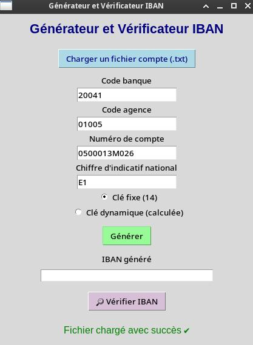

#### Tests IBAN valides / non valides

Test 1 : Iban généré à partir du fichier bankaccount.txt avec une clé calculé dynamiquement

> Code banque   20041 
> Code agence   01005 
> Numero de compte bancaire 0500013M026 
> Chiffre d'indicatif national  E1 

- Résultat : la clé est calculé dynamiquement, elle est égale à 82 et on a le message "IBAN valide" qui s'affiche, lorsqu'on vérfie l'iban

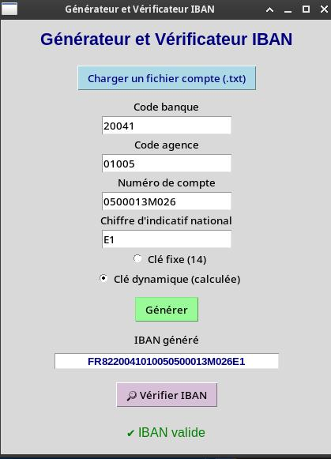

Test 2 : Iban généré à partir du meme fichier .txt, cette fois ci avec une clé static

- Résultat : la clé qui s'affiche au debut de l'iban est une clé fixe = à 14, et lorsqu'on vérifie l'IBAN, le message "IBAN invalide" s'affiche en rouge.

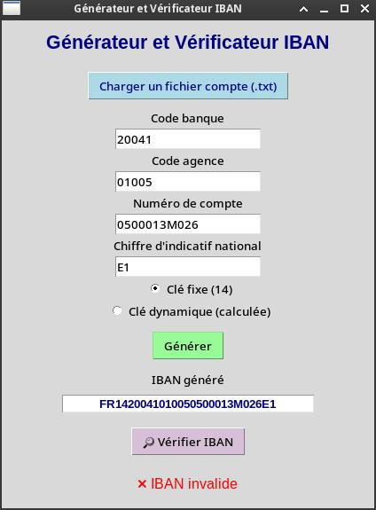

#### Tests de gestion d'erreurs

Test 3 : Fichier vide

- Résultat : On a le message "Le fichier est vide !" qui s'affiche lorsqu"on essaye de télécharger un fichier vide

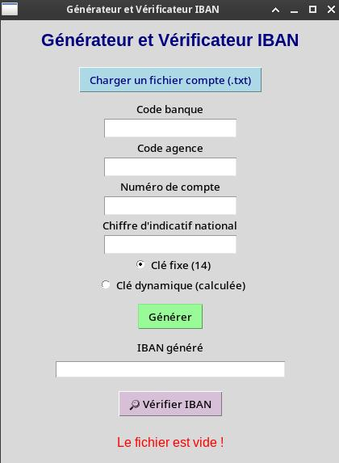

Test 4 : champs manquants - On enlève la ligne "Chiffre d'indicatif national	E1" du fichier

- Résultat : On a le message "Informations manquantes dnas le fichier" qui s'affiche en rouge

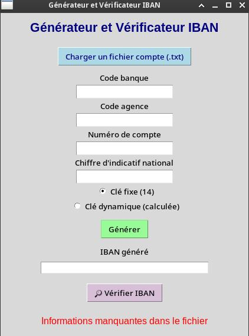

Test 5 : si je supprime une valeur manuellement (ex : le numéro de compte)

- Résultat : Le message "Champs manquants" s'affiche en rouge

Test 6 : Si je supprime manuellement la case IBAN généré

- Résultat : Le message "Aucun IBAN généré à vérifier s'affiche en rouge"

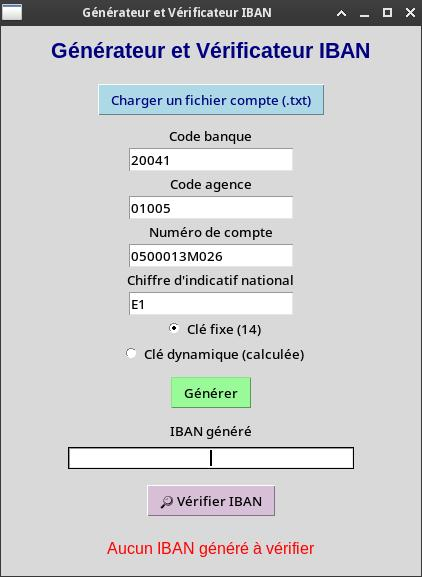

Test 7 : seulement la valeur à extraire manque - Exemple de fichier .txt

> Code banque   20041 
> Code agence   01005 
> Numero de compte bancaire 
> Chiffre d'indicatif national  E1 

- Résultat : On remarque qu'il manque la valeur à extraire qui corresond au "Numero de compte banquaire" - Le message "Informations manquantes dnas le fichier" s'affiche dans l'interface en rouge

Test 8 : si l'orthographe des mots clés à extraire est incorrecte (ex: chifre au lieu de chiffre)

- Résultat : L'information n'est pas récupérée, car le programme recherche les mots exactes définis dans extract_iban() - Le message "Informations manquantes dnas le fichier" s'affiche dans l'interface en rouge

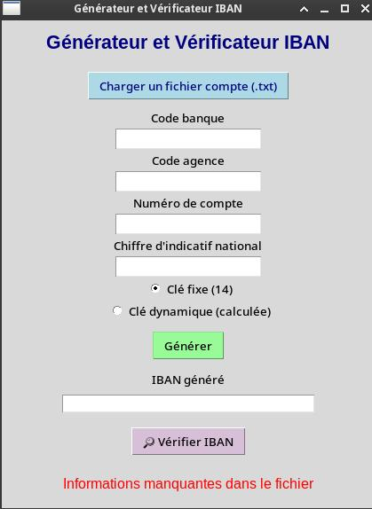

Test 9 : Si on change l'ordre des informations à extraire

> Numero de compte bancaire 0500013M026 
> Chiffre d'indicatif national  E1 
> Code banque   20041 
> Code agence   01005 

- Résultat : Le programme recupère quand même les informations de l'IBAN correctement

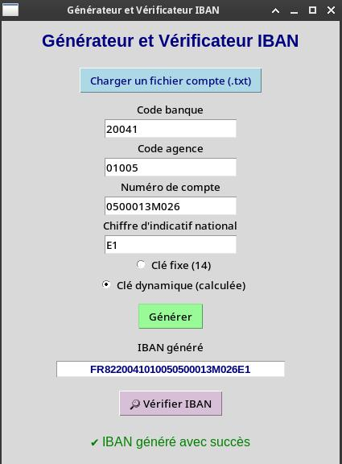

### ANALYSE ET COMMENTAIRES

- Le programme est plutôt robuste : il gère les erreurs courantes sans planter
- L'interface Tkinter est simple et intuitive
- Le test API garantit une validation externe et fiable

#### Limites

- Le script est limité au format IBAN français(FR...)

#### Améliorations futures possibles

- Génération d'IBANs multi-pays
- Interface plus ergonomique

### CONCLUSION

Le générateur IBAN est un outil combinant :
- Traitement de fichier texte
- Calcul algorithmique
- Interface graphique(Tkinter)
- Connexion à une API externe (OpenIBAN)

-------------------------------------------------------------

## DNA PROCESSING

### Objectif du projet :  

Le projet vise à compter le pourcentage de combinaison C+G ou G+C et A+T ou T+A d'une séquence d'ADN inscrite dans un fichier. 

Lorsque une séquence CGC apparaît cela compterait comme une seule combinaison. 

### Méthodologie :  

1. Définition de la fonction principale
---   
   La fonction ouvrir_traiter_fichier(zone_texte) (avec zone_texte le widget Text où on affichera le contenu du fichier et les résultats) permet de gérer toute la partie technique de notre programme. Entre autre elle permet d'ouvrir, de lire et d'analyser notre séquence d'ADN.

2. Ouverture du fichier et lecture du fichier 
----
    L'ouverture du fichier se fait grâce à la fonction open et la lecture par la fonction read :   
    try:
        with open(chemin, "r", encoding="utf-8") as f:
            contenu = f.read()
    
    En cas de problème lors de l'ouverture le système nous prévient de l'erreur grâce à un message textuel : 

    except Exception as e:
        messagebox.showerror("Erreur", f"Impossible de lire le fichier :\n{e}")
        return None

3. Analyse de l'ADN
---
    Une fois la séquence d'ADN récupérer, une boucle while va examiner la séquence par paire et incrémenter un compteur de CG/GC et TA/AT en fonction des comparaisons. 

    i = 0
    cg_count = 0
    at_count = 0
    while i < len(my_dna) - 1:
        pair = my_dna[i:i+2]
        if pair in ("CG", "GC"):
            cg_count += 1
            i += 2
            continue
        elif pair in ("AT", "TA"):
            at_count += 1
            i += 2
            continue
        i += 1

    La dernière ligne permet d'avancer d’une seule lettre pour continuer la recherche si aucune paire n'est identifié.

4. Interface Graphique (Tkinter)
---   
    Enfin grâce à l'import du module Tkinter sous le raccourci tk, on crée notre interface graphique qui affichera une fenêtre avec un bouton qui nous permettra d'ouvrir l'explorateur de fichiers afin de sélectionner notre séquence et de l'afficher avec le résultat de l'analyse de celle-ci. 

    On affiche le contenu du fichier :
    zone_texte.config(state=tk.NORMAL)
    zone_texte.delete("1.0", tk.END)
    zone_texte.insert(tk.END, contenu)

    On génère la fenêtre principale : 
    fenetre = tk.Tk()
    fenetre.title("Analyse ADN")
    fenetre.geometry("600x400")

    On crée la zone de texte :
    zone_texte = tk.Text(fenetre, wrap="word", width=70, height=20)
    zone_texte.pack(padx=10, pady=10)

    On crée le bouton d'action :
    bouton = tk.Button(fenetre, text="Ouvrir et analyser ADN", 
                    command=lambda: ouvrir_traiter_fichier(zone_texte))
    bouton.pack(pady=10)

    fenetre.mainloop()

### Résultats

1. Affichage de l'interface de sélection du fichier 

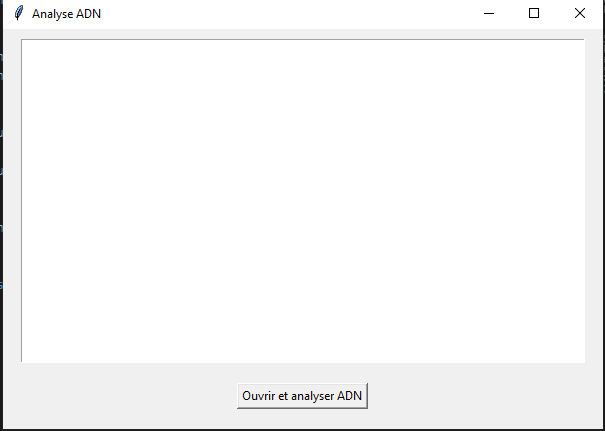

2. Ouverture de l'explorateur de fichier

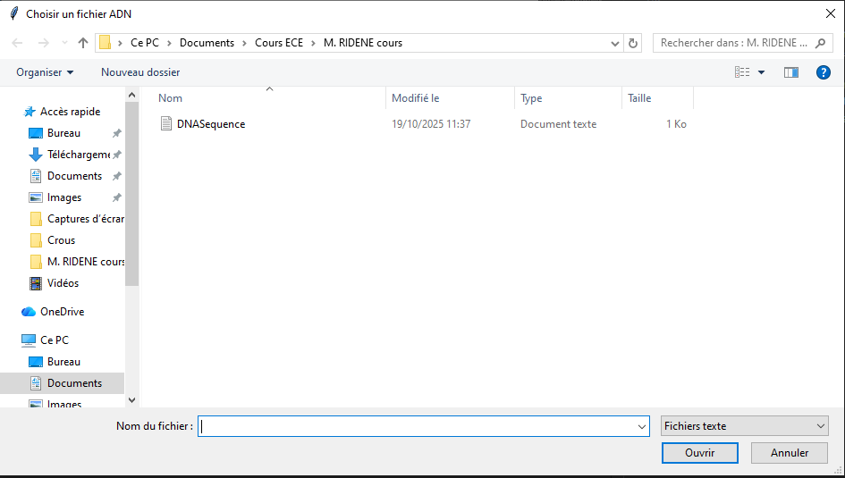

3. Affichage du fichier et résultats de l'analyse de séquence

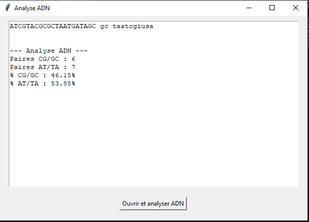

-------------------------------------------------------------

## SCRAPPING

...